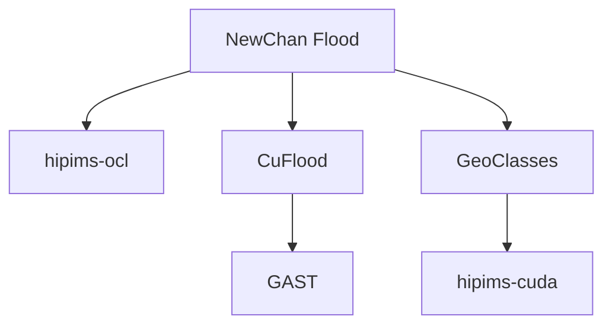

# HiPIMS Manual

Version 1.0

Qiuhua Liang, Xilin Xia, Xiaodong Ming

## Major version history

| Data      | Version | Milestone                                                    | Leading people           |
| --------- | ------- | ------------------------------------------------------------ | ------------------------ |
| Apr 2020  | 1.0.1   | First Public Release of hipims-cuda                          | Xilin Xia, Xiaodong Ming |
| Jan 2020  | 1.0     | Python-based prepocessing and post-processing for hipims-cuda | Xiaodong Ming            |
| July 2019 | 0.9     | Implemented drainage network model in hipims-cuda            | Qian Li                  |
| Nov 2016  | 0.8     | Implemented multi-gpu support in hipims-cuda                 | Xilin Xia                |
| Mar 2016  | 0.7     | Implemented Surface Reconstruction Method and Fully-implicit friction in hipims-cuda | Xilin Xia                |
| Feb 2015  | 0.6.5   | Implemented flow-like landslide movement in hipims-cuda      | Xilin Xia                |
| Oct 2015  | 0.6     | Implemented CUDA support into GeoClasses (changed name from GeoClasses to hipims-cuda) | Xilin Xia                |
| Nov 2014  | 0.5     | Proto-type C++ implementation using a modular code structure (GeoClasses) | Xilin Xia                |
| Mar 2014  | 0.4     | Sediment tranport implemented in CUFLOOD (became GAST)       | Jingming Hou             |
| Oct 2013  | 0.3     | CUDA implementation of the original version (CUFLOOD)        | Reza Amouzgar            |
| Sep 2012  | 0.2     | OpenCL implementation of the original version (hipims-ocl)   | Luke Smith               |
| 2008      | 0.1     | Original version in Fortran (NewChan-Flood)                  | Qiuhua Liang             |

## Genealogy of HiPIMS



## 1. Introduction

HiPIMS names for High-Performance Integrated hydrodynamic Modelling System. It uses state-of-art numerical schemes (Godunov-type finite volume) to solve the 2D shallow water equations for flood simulations. To support high-resolution flood simulations, HiPIMS is implemented on multiple GPUs (Graphics Processing Unit) using CUDA/C++ languages to achieve high-performance computing. Since HiPIMS has a modular and flexible structure, it has a great potential to be further developed for other applications in hydrological science as long as the problem can be solved on a uniform rectangular grid.

## 2. Compile and run the model

### System requirements

System with the following hardware is requested as a minimum:

- OS: Windows 7 64-bit or Linux 3.16 64-bit

- CPU: Intel Core i5 or AMD a10

- RAM: 8 GB System Memory

- GPU: Nvidia GeForce GTX 960

Some software packages with versions listed below or newer are also
essential:

- Nvidia CUDA Toolkit 7.5

- CMake 3.2

- GCC 4.8 or Visual Studio 2013

- Python 3.6

### Steps for compiling and running the model


The user should have knowledge of using CMake, Make and Microsoft Visual Studio. The procedures for compiling the code are
1. Download and install the latest version of CMake. For how to use CMake, please refer to: https://cmake.org
2. Creat a sub-folder with the name 'build' in the folder ‘hipims-cuda’.
3. Run CMake with setting the output directoty to 'build'.
4. Generate project files using CMake.
5. For windows, the VS project file will be in the folder 'build'. For linux, the Makefile will be in the folder 'build' as well.
6. Compile HiPIMS using VS or Make.
7. The executable files will be in 'release/bin'
8. Put executable files, input and output in the same folder and run the model.

## 3. Model Inputs

### Type of model inputs


The inputs of HiPIMS include three types of data: topography data to
provide the range of model domain and the elevation value of each cell
inside the domain, land cover data to setup friction and infiltration
parameters, and water source data to drive the model.

#### Topography

- DEM (Digital Elevation Model): a raster file (Gridded data set in
    ArcGrid ASCII format) representing surface height information of the
    model domain. It can be obtained from DigiMap.

- Bathymetry data of rivers and lakes: raster files (Gridded data set
    in ArcGrid ASCII format) or vectors of 3D points or lines to provide
    bed elevation in rivers and lakes with water removed. Bathymetry
    data can be acquired either from Digimap or local authorities
    depends on study areas.

#### Land cover map

- A raster file with the same range and format of DEM to indicate the
    physical land type such as grassland, forest, open water, urban
    area, etc. The types of land cover are used to set the friction and
    infiltration parameters that are essential in HiPIMS. Land cover
    maps are available in DigiMap.

#### Water sources

- Initial conditions: a raster file (Gridded data set in ArcGrid ASCII
    format) representing initial water depth of rivers and lakes in the
    model domain. Initial conditions can be obtained from field survey
    or generated by running HiPIMS for a couple of days on a dry DEM
    with designed or observed rainfall data.

- Rainfall: two files to provide the rainfall rate in each cell of the
    model domain. One file gives time series of rainfall rate values at
    different coverages (vectors in plain text files). The other file
    with the same format of DEM is to define the range and position of
    the rainfall coverages. Rainfall data can be obtained from surface
    station observations, radar rainfall, or numerical weather
    predictions.

- Boundary conditions: vectors in plain text files to provide water
    depths or discharges on boundary cells, like inflows from upstream
    or water depths in the outlets of the model domain. The water depth
    or discharge can be got from river gauge stations and tide stations.
### Description of Input files

The input folder includes two subfolders: *mesh*, *field*. A '*DEM.txt*'
file (Gridded data set in ArcGrid ASCII format) is stored in mesh
folder. All the other input files are stored in *field* folder. A time
setup file ('*times\_setup.dat*') provides four numeric values
representing model start time, model end time, output interval, and
backup interval in seconds, respectively. '*times\_setup.dat*' is not
compulsory as the four time-values can be type in manually when running
HiPIMS. All these input files can be generated by using a Python package.

Mesh file:

DEM.txt spatial reference of the DEM raster of the model domain in
ArcGrid data format

Field files:

There are typically 15 field files if one boundary condition was given
for depth and velocity. More field files would be created if there were
more boundary conditions. The fundamental files are introduced in Table 1.

*Table* *1. List of field files*

| File name | File type  | Notes |
| ----- | ------ | ----- |
| *z.dat* | Basic terrain | ID, type, and elevation values |
| *h.dat/eta.dat* | Initial conditions | initial water depth/elevation (m) |
| *hU.dat* |  | initial water velocities (m/s) |
| *precipitation.dat* |  | initial rainfall rate (m/s) |
| *manning.dat* | Friction parameter | friction coefficient |
| *hydraulic\_conductivity.dat* | Green-Ampt infiltration parameters | hydraulic conductivity |
| *cumulative\_depth.dat* |  | cumulative depth |
| *capillary\_head.dat* |  | capillary head |
| *water\_content\_diff.dat* |  | water content difference |
| *sewer\_sink.dat* | Drainage parameter | sewer sink rate |
| *h\_BC\_N.dat* | Boundary conditions | water depth on the N^th^ boundary |
| *hU\_BC\_N.dat* |  | water velocities on the N^th^ boundary |
| *precipitation\_mask.dat* | Rainfall sources | rainfall source ID |
| *precipitation\_source\_all.dat* |  | time series of all rainfall sources |
| *gauges\_pos.dat* | Gauge monitoring | Coordinates of monitoring points |
| Other files: |  |  |
| *times\_setup.dat* | Four values respectively indicate model start time, total time, output interval, and backup interval in seconds |  |
| *device\_setup.dat* | Values to define the ID of GPU devices that used to run model in each subdomain. |  |

## 4. Model Outputs

The outputs of HiPIMS include three types:

- Water depth and velocities at predefined moments during a simulated
    event: gridded data sets in ArcGrid ASCII format with the same size
    of DEM.

- The maximum water depth and velocities throughout the event: a
    gridded data set in ArcGrid ASCII format with the same size of DEM.

- Time series of water depth and velocities including rainfall over
    the model domain and inflow and outflow boundary conditions:
    time-value vectors in plain text file.
    
## 5. Preprocessing and Post-processing

The package [hipims_io](https://pypi.org/project/hipims-io/) can be used to create the inputs and visualise the outputs of HiPIMS. You need to have basic knowledge about using Python.

Python version: >=3.6.

To install hipims_io:
```
pip install hipims_io
```
A demonstration to setup a HiPIMS input object with a sample DEM:
```
>>> import hipims_io as hp
>>> obj_in = hp.demo_input() # create an input object and show
>>> obj_in.write_input_files()
```
After these steps, an sample input is created in the folder where you run Python.

An example of step-by-step setup a HiPIMS input object with more detailed information from sample data:

```
>>> import os
>>> import hipims_io as hp
>>> case_folder = os.getcwd() # use the current path as a case folder
>>> obj_dem, model_data = hp.get_sample_data() # get sample data
>>> obj_in = InputHipims(dem_data=obj_dem, num_of_sections=1, case_folder=case_folder)
# set a initial water depth of 0.5 m
>>> obj_in.set_parameter('h0', 0.5)
# set boundary condition
>>> bound_list = demo_data['boundary_condition'] # with boundary information
>>> obj_in.set_boundary_condition(bound_list, outline_boundary='fall')
# set rainfall mask and source
>>> rain_source = demo_data['rain_source']
>>> obj_in.set_rainfall(rain_mask=0, rain_source=rain_source)
# set monitor positions
>>> gauges_pos = demo_data['gauges_pos']
>>> obj_in.set_gauges_position(gauges_pos) 
# display model information
>>> obj_in.domain_show() # show domain map
>>> print(obj_in) # print model summary
# write all input files for HiPIMS
>>> ob
```
You can use the help function of python to view detailed documentation of hipims_io. Alternatively, you can use PyDoc to view the documentation in web browser. To do so, you need to run the following command in terminal
```
pydoc -b
```
Then search hipims_io in the search box to open the documentation.

## References

The algorithms used in the current version are documented in the following papers, please cite them if you use the code for your publications

1. X. Xia, Q. Liang, X. Ming, J. Hou (2017) An efficient and stable hydrodynamic model with novel source term discretization schemes for overland flow and flood simulations. Water Resources Research, 53, 3730-3759.
2. X. Xia, Q. Liang (2018) A new efficient implicit scheme for discretising the stiff friction terms in the shallow water equations. Advances in Water Resources, 117, 87-97
3. X. Xia, Q. Liang, X. Ming (2019) A full-scale fluvial flood modelling framework based on a High-Performance Integrated hydrodynamic Modelling System (HiPIMS). Advances in Water Resources, doi: 10.1016/j.advwatres.2019.103392
4. Q. Li, Q. Liang, X. Xia (2020), A novel 1D-2D coupled model for hydrodynamic simulation of flows in drainage networks, Advances in Water Resources, 137, 103519